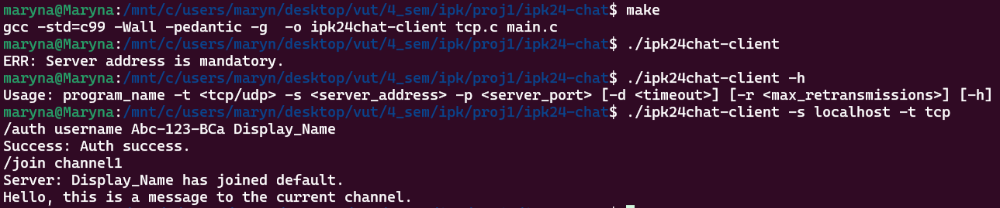
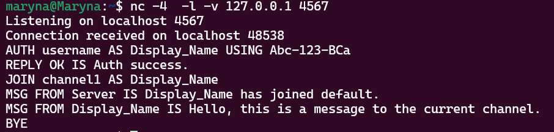
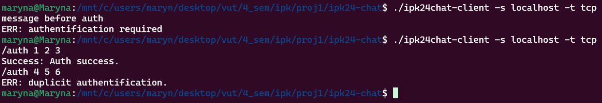
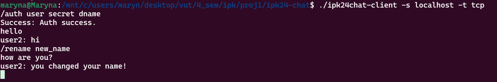
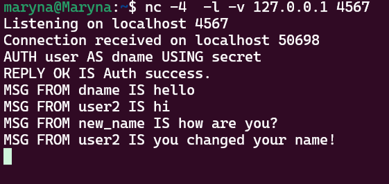
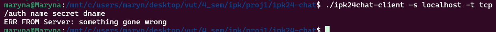
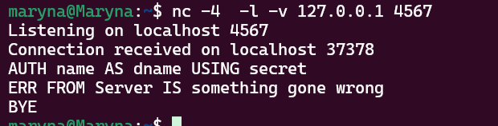

# IPK24-CHAT
This project's task was to implement a client application, which is able to communicate with a remote server using the IPK24-CHAT protocol. I implemented only the TCP variant.

## Program arguments
Program support this types of arguments:
- `-t` : transport protocol (tcp/udp).
- `-s` : server IP or hostname.
- `-p` : server port (defaul value 4567).
- `-d` : UDP confirmation timeout (defaul value 250).
- `-r` : maximum number of UDP retransmissions (defaul value 3).
- `-h` : prints program help output and exits.
Transport protocol and server IP are mandatory arguments.

## Client behaviour
Client writes commands in `stdin` and receives a response from server to the `stdin` or `stderr`.
- `/auth {Username} {Secret} {DisplayName}` Sends AUTH message with the provided data.
- `/join {ChannelID}` Sends JOIN message with channel name.
- `/rename	{DisplayName}` Locally changes the display name of the user.
- `/help` Prints out supported local commands with their parameters and a description.
Order of the command parameters must stay stay the same as shown.

## Client output
- Incoming message `{DisplayName}: {MessageContent}\n`.
- Incoming error `ERR FROM {DisplayName}: {MessageContent}\n`.
- Internal client aplication error `ERR: {MessageContent}\n`.
- Incoming reply `Success\Failure: {MessageContent}\n`.

## Implementation
The program is written in the C programming language. The source code is located in the files main.c, tcp.c, and tcp.h. By using the `make` command in the root folder, a binary file named `ipk24chat-client` will be created, which can be executed. The main implementation of the protocol behavior (parsing arguments, creating a socket, connecting to the server, communicating with the server, transitioning between different program states) is implemented in the `main.c` file. Auxiliary functions (converting user-entered commands into the format required by the server and vice versa) are implemented in the `tcp.c` and `tcp.h` files.
The function `sigint_handler()` was implemented to recognize the `Ctrl+C` signal and perform the proper termination of all processes and exit the program. The function `get_host_by_name(char *hostname)` was written to handle the hostname argument and convert it into an IP address.

## Testing
The testing was conducted manually using the command `nc -4 -c -l -v 127.0.0.1 4567`. I utilized the provided examples of system and user behavior.

Tested authentification errors: no auth, multiple auth. Program correctly identify this errors and ends behavior.

Tested rename command and message command. Program change displayname and correctly hamdle income and outcome messages.

Tested error command. Program process income error message, send bye to server and correctly ends behavior.

The program can receive multiple receives between sends, but it is impossible to test this on a local server.